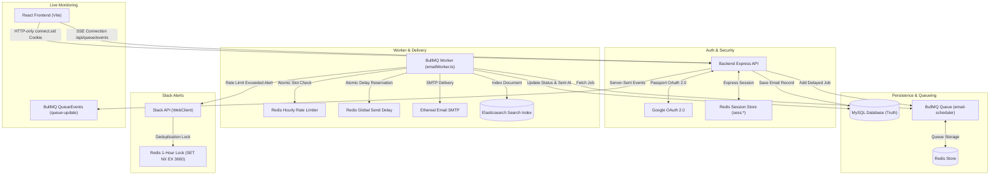

# Email Scheduler Application — Full Stack Production System

A production-grade, distributed automated Email Scheduling platform built with **TypeScript**, **Express.js**, **MySQL**, **Redis**, **BullMQ**, **Nodemailer (Ethereal SMTP)**, **Elasticsearch**, **Google OAuth 2.0**, **Slack OAuth 2.0**, and **React (Vite)**.

---

## 1. System Architecture & Component Diagram



---

## 2. Key System Features

1. **Google OAuth 2.0 & Redis Sessions**:
   - Authenticates users with official Google OAuth 2.0 (`passport-google-oauth20`).
   - Server-side Express sessions (`express-session`) stored directly in Redis (`connect-redis`).
   - HTTP-only browser session cookies (`connect.sid`). Zero JWT, zero `localStorage` auth tokens, zero URL tokens.

2. **Persistent Email Scheduling & BullMQ Queueing**:
   - MySQL database serves as the absolute source of truth for email records.
   - BullMQ persistent delayed jobs manage scheduled email execution across system restarts and worker crashes.

3. **Multiple Senders Identity Support**:
   - Authenticated users configure multiple outgoing sender identities (`"Sender Name" <sender@example.com>`).
   - Enforces composite unique constraint `(user_id, email)`. Senders are strictly scoped by user ownership (`WHERE user_id = ?`).
   - Deleting a sender sets `emails.sender_id = NULL` (`ON DELETE SET NULL`) preserving all historical email logs and search indices.

4. **Configurable Hourly Rate Limiting**:
   - Distributed hourly rate limit (`EMAILS_PER_HOUR`) using Redis atomic counters.
   - When hourly quota is consumed, remaining jobs are automatically delayed/rescheduled to the next UTC hour without dropping emails or marking them as failed.

5. **Global Minimum Send Delay**:
   - Configurable minimum delay (`MIN_SEND_DELAY_MS`) between individual email sends.
   - Coordinated atomically across multiple worker threads using Redis key timestamps (`email-send-delay:next`).

6. **Full-Text Elasticsearch Search**:
   - Indices delivered and scheduled emails in Elasticsearch (`emails` index).
   - Fast full-text search by recipient, subject, and body with status filtering and bulk reindexing endpoints.
   - Graceful degradation: If Elasticsearch fails or is offline, email scheduling and SMTP sending continue without downtime.

7. **Slack OAuth 2.0 & Hourly Rate Limit Notifications**:
   - Authenticated users connect Slack workspaces via standard OAuth 2.0 authorization code grant.
   - Stores encrypted tokens server-side in MySQL `slack_connections` table.
   - Automated rate-limit notifications sent to user's selected Slack channel when hourly limit is reached.
   - Redis 1-hour deduplication lock (`slack-rate-limit-notified:<userId>:<UTC-hour>`) guarantees at most one Slack message per hour.

8. **Live BullMQ Monitoring Dashboard (`/queue`)**:
   - Real-time queue metrics: Waiting, Active, Delayed, Completed, Failed counts.
   - Infrastructure status: Redis ping, Queue health, Worker concurrency.
   - Paginated user-scoped jobs table with status filter tabs (`Waiting`, `Active`, `Delayed`, `Completed`, `Failed`).
   - Job detail drawer showing safe metadata and failure reasons.
   - **Server-Sent Events (SSE)**: Stream live updates (`/api/queue/events`) directly from BullMQ `QueueEvents`. **Zero polling timers, zero `setInterval`/`setTimeout`, zero cron jobs.**

---

## 3. Technology Stack

- **Backend**: Node.js, TypeScript, Express.js, Passport.js, BullMQ, ioredis, mysql2, Nodemailer, @elastic/elasticsearch, @slack/web-api.
- **Frontend**: React 18, TypeScript, Vite, React Router DOM, Modern CSS (Tailwind).
- **Databases & Middleware**: MySQL 8.0, Redis / Memurai, Elasticsearch 8.x.

---

## 4. Environment Variables Reference

Copy `backend/.env.example` to `backend/.env`:

```env
PORT=5000
DB_HOST=localhost
DB_PORT=3306
DB_NAME=email_scheduler
DB_USER=root
DB_PASSWORD=

REDIS_HOST=127.0.0.1
REDIS_PORT=6379

WORKER_CONCURRENCY=5
EMAILS_PER_HOUR=10
MIN_SEND_DELAY_MS=2000

# Ethereal Email SMTP Configuration
ETHEREAL_HOST=smtp.ethereal.email
ETHEREAL_PORT=587
ETHEREAL_USER=your_ethereal_username
ETHEREAL_PASSWORD=your_ethereal_password
ETHEREAL_FROM="Email Scheduler <your_ethereal_username>"

# Elasticsearch Configuration
ELASTICSEARCH_NODE=http://localhost:9200
ELASTICSEARCH_INDEX=emails

# Google OAuth Configuration
GOOGLE_CLIENT_ID=your_google_client_id_here
GOOGLE_CLIENT_SECRET=your_google_client_secret_here
GOOGLE_CALLBACK_URL=http://localhost:5000/api/auth/google/callback
SESSION_SECRET=super_secret_session_key_change_in_production
FRONTEND_URL=http://localhost:5173

# Slack OAuth Configuration
SLACK_CLIENT_ID=your_slack_client_id_here
SLACK_CLIENT_SECRET=your_slack_client_secret_here
SLACK_REDIRECT_URI=http://localhost:5000/api/slack/callback
SLACK_SCOPES=chat:write,channels:read
```

Copy `frontend/.env.example` to `frontend/.env`:

```env
VITE_API_URL=http://localhost:5000
```

---

## 5. Prerequisites & Local Setup

### System Prerequisites
1. Node.js (v18 or higher) & npm
2. MySQL Database Server (Running on port 3306 with database `email_scheduler`)
3. Redis Server / Memurai (Running on port 6379)
4. Elasticsearch Server (Optional, default `http://localhost:9200`)

### Backend Installation & Startup
```bash
cd backend
npm install
npm run build
npm run dev
```

### Standalone BullMQ Worker Startup (Separate Terminal)
```bash
cd backend
npm run worker
```

### Frontend Installation & Startup
```bash
cd frontend
npm install
npm run build
npm run dev
```
Open `http://localhost:5173` in your web browser.

---

## 6. API Reference Overview

### Health Endpoints
- `GET /health`: Express API status.
- `GET /health/db`: MySQL database status.
- `GET /health/redis`: Redis connection status.
- `GET /health/elasticsearch`: Elasticsearch reachability status.

### Authentication Endpoints
- `GET /api/auth/google`: Initiates Google OAuth consent flow.
- `GET /api/auth/google/callback`: OAuth callback, creates/fetches MySQL user, initializes Redis session cookie.
- `GET /api/auth/me`: Returns current authenticated user profile (`{ authenticated: true, user }`).
- `POST /api/auth/logout`: Destroys Redis session and clears HTTP-only cookie.

### Sender Accounts Endpoints (Requires Auth)
- `GET /api/senders`: Returns user's sender identities.
- `POST /api/senders`: Creates new sender (`{ email, name }`).
- `GET /api/senders/:id`: Gets single sender owned by user.
- `PUT /api/senders/:id`: Updates sender details.
- `DELETE /api/senders/:id`: Deletes sender (email `sender_id` becomes `NULL`).

### Email Campaign & Search Endpoints (Requires Auth)
- `POST /api/emails/schedule`: Schedules an email job with idempotency protection.
- `GET /api/emails/scheduled`: Returns scheduled email queue for user.
- `GET /api/emails/:id`: Returns single email details.
- `GET /api/emails/search?q=...&status=...&page=...&limit=...`: Full-text Elasticsearch search.
- `POST /api/emails/search/reindex`: Reindexes user emails into Elasticsearch.

### Slack Integration Endpoints (Requires Auth)
- `GET /api/slack/connect`: Initiates Slack OAuth flow with CSRF state generation.
- `GET /api/slack/callback`: Handles callback and saves Slack token in MySQL.
- `GET /api/slack/status`: Returns `{ connected: boolean, teamId, channelId }`.
- `GET /api/slack/channels`: Lists accessible Slack channels.
- `POST /api/slack/channel`: Body `{ channelId }`. Sets alert channel.
- `POST /api/slack/disconnect`: Removes Slack connection.

### BullMQ Live Dashboard Endpoints (Requires Auth)
- `GET /api/queue/stats`: Returns global queue counts and user job statistics.
- `GET /api/queue/jobs?status=...&page=...&limit=...`: Returns paginated user jobs.
- `GET /api/queue/jobs/:jobId`: Returns safe metadata for single job or 404.
- `GET /api/queue/health`: Infrastructure health overview.
- `GET /api/queue/events`: Authenticated Server-Sent Events (SSE) live stream.

---

## 7. Automated Test Suite Execution

Run the complete automated end-to-end integration test suite:

```bash
node scratch/test_final_integration.js
```

Runs comprehensive tests for health, database schema, user isolation, scheduling idempotency, rate limiting, Elasticsearch search, Slack notification deduplication, and BullMQ live queue monitoring.

---

## 8. License & Project Status

- **Status**: Production Ready & GitHub Submission Ready
- **Build Status**: Backend (`0 errors`), Frontend (`0 errors`).
