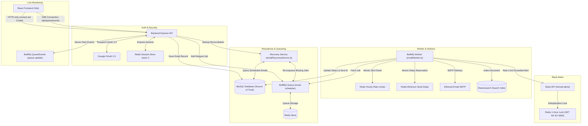

# Email Scheduler Application — Production System

A production-grade, distributed automated Email Scheduling platform built with **TypeScript**, **Express.js**, **MySQL**, **Redis**, **BullMQ**, **Nodemailer (Ethereal SMTP)**, **Elasticsearch**, **Google OAuth 2.0**, **Slack OAuth 2.0**, and **React (Vite)**.

---

## 1. System Architecture Overview



### Core Architecture Components

#### A. How Email Scheduling Works
1. **User Scheduling Request**: The user submits a scheduled email via the React frontend or `POST /api/emails/schedule`.
2. **Database Record Creation**: An email record is created in MySQL with `status = 'scheduled'`, saving the recipient, subject, body, sender identity, and `scheduled_at` timestamp. Idempotency is enforced using a unique `idempotency_key`.
3. **BullMQ Delayed Enqueueing**: A BullMQ delayed job is created with a deterministic job ID (`email-${emailId}`) and a calculated delay `delay = Math.max(0, scheduledAt - Date.now())`.
4. **Database Cross-Reference**: The generated BullMQ job ID is saved in MySQL `queue_job_id`.

#### B. How Persistence & Recovery on Server Restart is Handled
1. **Source of Truth**: The MySQL database serves as the absolute source of truth for all scheduled emails.
2. **Startup Reconciliation Service (`emailRecoveryService.ts`)**:
   - On backend application or worker startup, the recovery service runs **before** worker processing begins.
   - It queries MySQL for all emails where `status = 'scheduled'` (and resets any emails stuck in `processing` due to an unexpected crash back to `scheduled`).
   - For every pending email:
     - It checks whether its corresponding BullMQ job exists in Redis (`emailQueue.getJob('email-' + email.id)`).
     - **Job Exists**: If the job is active, waiting, or delayed in BullMQ, recovery skips it (preventing duplicate enqueuing).
     - **Job Missing**: If Redis was restarted or flushed, recovery recreates the delayed job in BullMQ using the original `scheduled_at` timestamp.
     - **Overdue Emails**: If `scheduled_at` passed while the backend was offline, `delay` is set to `0`, causing BullMQ to process and send the email immediately upon startup.

#### C. How Rate Limiting & Concurrency are Implemented
1. **Configurable Hourly Rate Limiting**:
   - Configured via `EMAILS_PER_HOUR` in `.env` (default: 10 emails/hour).
   - Enforced atomically using a Redis Lua script (`email-rate-limit:YYYY-MM-DD-HH`).
   - When hourly quota is consumed, remaining jobs are automatically delayed/rescheduled to the next UTC hour window (`moveToDelayed`) without dropping emails or failing jobs.
2. **Atomic Minimum Send Delay**:
   - Configured via `MIN_SEND_DELAY_MS` in `.env` (default: 2000ms).
   - Coordinates email execution across concurrent worker threads using Redis atomic timestamp keys (`email-send-delay:next`).
3. **Worker Concurrency**:
   - Configured via `WORKER_CONCURRENCY` in `.env` (default: 5 concurrent jobs).
   - Managed directly by BullMQ worker instances consuming jobs from the Redis queue.

---

## 2. Environment Variables & Ethereal SMTP Setup

### Setting up Ethereal Email SMTP Credentials
1. Go to [https://ethereal.email](https://ethereal.email) in your web browser.
2. Click **Create Ethereal Account**.
3. Copy your generated `Account / Username` and `Password`.
4. Paste these values into your `backend/.env` file under `ETHEREAL_USER` and `ETHEREAL_PASSWORD`.

### Backend Environment Configuration (`backend/.env`)
Create `backend/.env` with the following variables:

```env
PORT=5000
DB_HOST=localhost
DB_PORT=3306
DB_NAME=email_scheduler
DB_USER=root
DB_PASSWORD=your_mysql_password

REDIS_HOST=127.0.0.1
REDIS_PORT=6379

WORKER_CONCURRENCY=5
EMAILS_PER_HOUR=10
MIN_SEND_DELAY_MS=2000

# Ethereal Email Configuration
ETHEREAL_HOST=smtp.ethereal.email
ETHEREAL_PORT=587
ETHEREAL_USER=your_ethereal_username@ethereal.email
ETHEREAL_PASSWORD=your_ethereal_password
ETHEREAL_FROM="Email Scheduler <your_ethereal_username@ethereal.email>"

# Elasticsearch Configuration (Optional)
ELASTICSEARCH_NODE=http://localhost:9200
ELASTICSEARCH_INDEX=emails

# Google OAuth Configuration
GOOGLE_CLIENT_ID=your_google_client_id
GOOGLE_CLIENT_SECRET=your_google_client_secret
GOOGLE_CALLBACK_URL=http://localhost:5000/api/auth/google/callback
SESSION_SECRET=super_secret_session_key_change_in_production
FRONTEND_URL=http://localhost:3000

# Slack OAuth Configuration
SLACK_CLIENT_ID=your_slack_client_id
SLACK_CLIENT_SECRET=your_slack_client_secret
SLACK_REDIRECT_URI=http://localhost:5000/api/slack/callback
SLACK_SCOPES=chat:write,channels:read,groups:read
```

### Frontend Environment Configuration (`frontend/.env`)
Create `frontend/.env` with:

```env
VITE_API_URL=http://localhost:5000
```

---

## 3. Local Setup & How to Run

### System Prerequisites
1. **Node.js** (v18 or higher) & **npm**
2. **MySQL Database Server** (Running on port 3306 with database `email_scheduler`)
3. **Redis Server / Memurai** (Running on port 6379)

---

### Step 1: Start Backend API & Worker
```bash
cd backend
npm install
npm run build
npm run dev
```
*(The backend server automatically initializes MySQL tables, runs scheduled email recovery reconciliation, and starts the BullMQ worker on startup.)*

To run a standalone worker in a separate terminal:
```bash
cd backend
npm run worker
```

---

### Step 2: Start Frontend Application
In a separate terminal:
```bash
cd frontend
npm install
npm run build
npm run dev
```
Open **[http://localhost:3000](http://localhost:3000)** in your browser.

---

## 4. List of Implemented Features

### Backend Features
- **Idempotent Scheduler**: Schedules email jobs with duplicate protection and persistent delayed BullMQ queues.
- **Restart Reconciliation & Persistence**: `emailRecoveryService.ts` restores missing jobs and enqueues overdue emails automatically across server/Redis restarts.
- **Distributed Hourly Rate Limiting**: Redis Lua script limits outgoing emails per hour and reschedules excess jobs cleanly.
- **Atomic Minimum Send Delay**: Enforces spacing between individual email dispatches across concurrent worker threads.
- **Worker Concurrency**: Configurable BullMQ worker executing up to `WORKER_CONCURRENCY` jobs in parallel.
- **Ethereal SMTP Integration**: Delivers real test emails and logs Ethereal preview URLs for verification.
- **Multiple Outgoing Senders**: Supports user-scoped sender identities with `ON DELETE SET NULL` database foreign key safety.
- **Slack OAuth & `#email-alerts` Channel Support**: Authenticates Slack workspaces, lists channels via Slack API, supports selecting `#email-alerts`, and sends rate-limit alerts.
- **Elasticsearch Search Index**: Real-time full-text email search with graceful degradation fallback.
- **Google OAuth 2.0 & Redis Session Store**: Secure authentication using HTTP-only session cookies (`connect.sid`).
- **Server-Sent Events (SSE)**: Streams live BullMQ queue updates (`/api/queue/events`) without polling timers.

### Frontend Features
- **Google OAuth Login Interface**: Clean sign-in page with session cookie management.
- **Dashboard Overview**: Metrics overview cards for Scheduled, Sent, and Failed emails.
- **System Infrastructure Health Cards**: Live connectivity indicators for Express API, MySQL, Redis, and Elasticsearch.
- **Compose Email Campaign Modal**: Form with recipient parsing, custom sender identity selection, subject, body, and datetime picker.
- **Scheduled Emails Table View**: Real-time table displaying pending campaigns with status indicators.
- **Sent Emails Search & Pagination View**: Full-text search interface filtering sent and failed email history.
- **Live BullMQ Queue Monitor (`/queue`)**: Interactive monitoring dashboard showing job counts (`Waiting`, `Active`, `Delayed`, `Completed`, `Failed`), job detail drawer, and live SSE updates.
- **Slack Settings & Channel Selector**: Connects Slack workspaces, presents accessible channel dropdown (with explicit error handling if `#email-alerts` requires app invitation), and displays `Notification Channel: #email-alerts`.
- **Sender Manager**: Interface to add, update, and remove outgoing sender email addresses.

---

## 5. Collaborator Access

To grant repository access to **`Mitrajit`** and **`Yadav036`**:
1. Go to the GitHub repository: **[https://github.com/harishmanthrabuddi-blip/Email-Schedulerproject](https://github.com/harishmanthrabuddi-blip/Email-Schedulerproject)**
2. Click **Settings** $\rightarrow$ **Collaborators**.
3. Click **Add people** and invite:
   - `Mitrajit`
   - `Yadav036`
